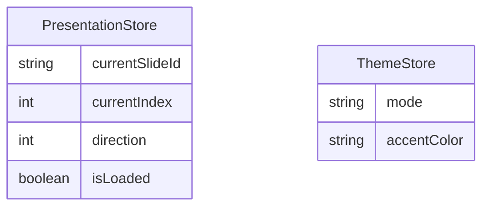

# SCHEMA-DESIGN-PRESENTATION
**Project:** Apex Sentinel Presentation Deck

### 1. Domain Overview
- Wave scope: State management for the presentation deck.
- Out of scope: Database tables (since this is a pure frontend visualization layer with no backend persistence).

### 2. Entity Relationship Diagram

### 3. Table Specifications
*N/A - This is a client-side presentation app using Zustand for global state. No Supabase/PostgreSQL schema is required.*

### 4. Functions and Triggers
*N/A*

### 5. RLS Policies
*N/A*

### 6. Migration Timestamp
*N/A*

### 7. API Route Plan
*N/A*

### 8. UI Page Plan
- `app/page.tsx`: The single-page interactive Next.js application containing the Presentation Controller, `<Canvas>`, and `<AnimatePresence>`.
